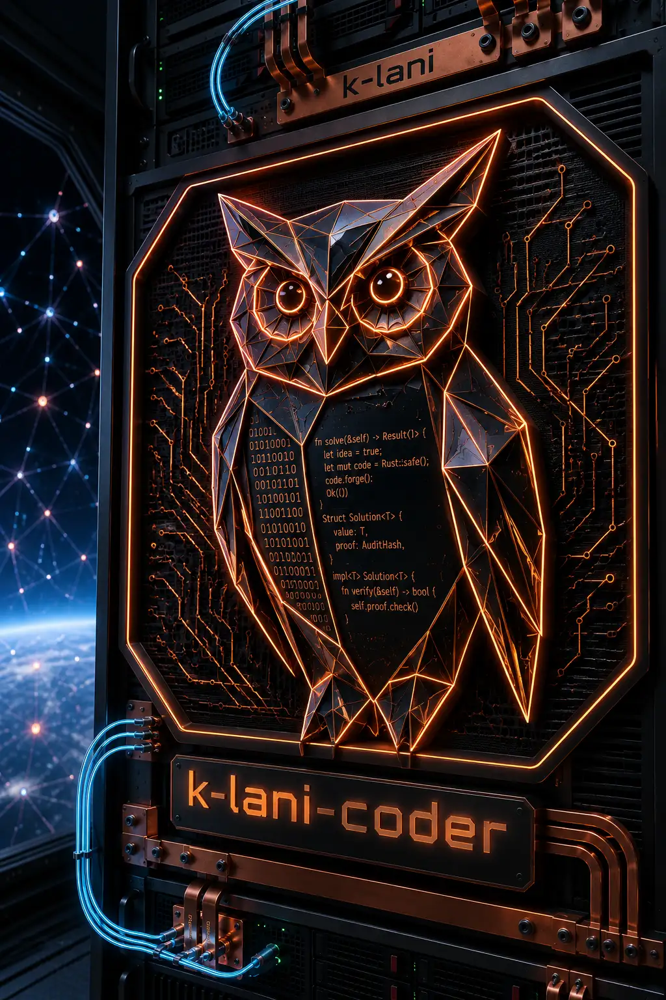

# k-lani-coder — Closed Binary Release (Demo Bundle)



**Release 2026.24.2** — versions are CalVer `YEAR.ISOWEEK.SEQ`, so you
can always tell how old a build is at a glance (`k-lani-coder
--version`). Same-week re-releases bump the final number (0–99).

A symbol-slice context harness and agent orchestration system for AI
coding, built on the k-lani database engine. It serves any MCP-capable
agent frontend (Claude Code, opencode) exactly one budgeted slice of
your Rust or TypeScript codebase per task, guards every write with a
chain of independent safety layers, and runs a WORM ticket board where
planner and worker models hand each other contracts under a
code-enforced four-eyes rule — every step lands in an immutable audit
ledger you can inspect yourself.

The short version of using it: `k-lani-coder onboard` (existing
repos: one clean baseline-format commit, blame-shielded), then
`k-lani-coder quickstart` (index + session hub + live board, one
command), then tell the **conductor** — one assistant wired into your
chat frontend — *"we need X, please get it done."* Many agents work
one board concurrently; when a ticket lands, its **receipt** shows
who built what, the gate's verdict, and the measured cost.

**Evaluation build, openly declared:** `--version` shows this build's
expiry date. After it, `index` and `serve` refuse to start and point
at the current release; every read-only command (board, report,
context, codemap) keeps working forever. Your data is never hostage —
that promise is part of the design, not the marketing.

**Start here:** [SHOWCASE.md](SHOWCASE.md) — the measured results
(12.6× token reduction on the headline case, a free local 12B model
completing real Rust changes, the honest list of where a classic
agent still wins). Every number comes from the bundled
[reports/](reports/) and is reproducible with the bundled protocol.

## Bundle contents

| Path | What it is |
|---|---|
| `bin/k-lani-coder` | indexer + MCP server/hub + board + CLI (Linux x86_64) |
| `bin/k-lani-ai-proxy` | metering relay: per-request token/cost ledger, key custody |
| `bin/SHA256SUMS` | checksums for both binaries |
| `ARCHITECTURE.md` | the whitepaper: method, measured results, security posture |
| `GETTING_STARTED.md` | five-minute setup: onboard, quickstart, conductor, board |
| `PROXY.md` | upstreams (OpenAI, Anthropic/Claude Code, local), pricing, ticket cost tagging |
| `SHOWCASE.md` | measured results & safety story |
| `BENCHMARKS.md` | full benchmark tables + methodology |
| `prompts/` | worker, planner, and conductor profiles |
| `demo/board-demo.sh` | the moving demo sprint (real machinery, throwaway board) |
| `reports/` | raw per-run token reports from the bench sessions |
| `LICENSE.md` | BSL 1.1 + supplementary terms (binding) |
| `SECURITY.md` | disclosure process and fix timelines |

## Docker (ready to run)

```bash
docker build -t k-lani-coder:2026.24.2 .

# metering proxy as a service (key lives in .env, dashboard loopback-only)
cp .env.example .env && docker compose up -d

# index your workspace (run as your user so files keep your ownership)
docker run --rm --user $(id -u):$(id -g) -v "$PWD":/work \
  k-lani-coder:2026.24.2 k-lani-coder index --workspace /work --data-dir /work/data/coder

# the harness as MCP server for your agent frontend:
#   "command": ["docker","run","--rm","-i","--user","UID:GID",
#               "-v","/path/to/repo:/work","k-lani-coder:2026.24.2",
#               "k-lani-coder","serve","--data-dir","/work/data/coder",
#               "--workspace","/work"]
```

The image is Rust-toolchain-based on purpose: the write gate runs
`cargo check`/`test` and rustfmt inside the container — the toolchain
IS the safety layer. In sandboxed environments the engine automatically
falls back from io_uring direct I/O to buffered writes with fsync (you
will see a one-line `[wal]` notice; durability semantics are unchanged).

## No phoning home — and you can verify it

- `k-lani-coder` makes **zero outbound network connections**. It
  speaks MCP on stdio and, for the live board, listens on loopback.
  No telemetry, no update check, no license callback — the evaluation
  expiry is a local date comparison baked into the binary.
- The only bundled component that talks to the network at all is
  `k-lani-ai-proxy`, and it connects to exactly one place: the
  upstream URL **you** configure (`MKLANI_UPSTREAM`). Point it at a
  local llama.cpp server and the entire loop runs with zero bytes
  leaving your machine.
- Don't take our word for it — watch the binaries yourself:

  ```bash
  strace -f -e trace=network k-lani-coder index --workspace . --data-dir data/coder
  # → no connect() calls. The proxy under the same lens connects
  #   only to the host you set as MKLANI_UPSTREAM.
  ```

## What the proxy dashboard shows (read before exposing it)

- **Shown:** every request/response payload — i.e. your prompts and
  your source-code slices — plus per-request token counts and costs.
  That is its job: it is the operator's measuring instrument.
- **Never shown:** provider keys. All keys known to the proxy (vault
  entries, `MKLANI_UPSTREAM_API_KEY`) are registered as protected
  literals and masked everywhere, including inside payload text.
  Verified empirically against `/api/traces` and the dashboard HTML,
  and pinned by a unit test in the source tree.
- Consequence: treat the dashboard like your editor screen, not like a
  status page. The compose file binds it to `127.0.0.1` — keep it that
  way on shared machines.

## License & scope

Free for personal projects and organizations under $100k annual gross
revenue; everything else needs a commercial license — see `LICENSE.md`
(the bundled text is binding, this README is not). This release
indexes Rust (`.rs`) and TypeScript (`.ts`/`.tsx`); the language lane
is chosen per file extension, and the architecture adds languages as
lanes, not as rewrites.
